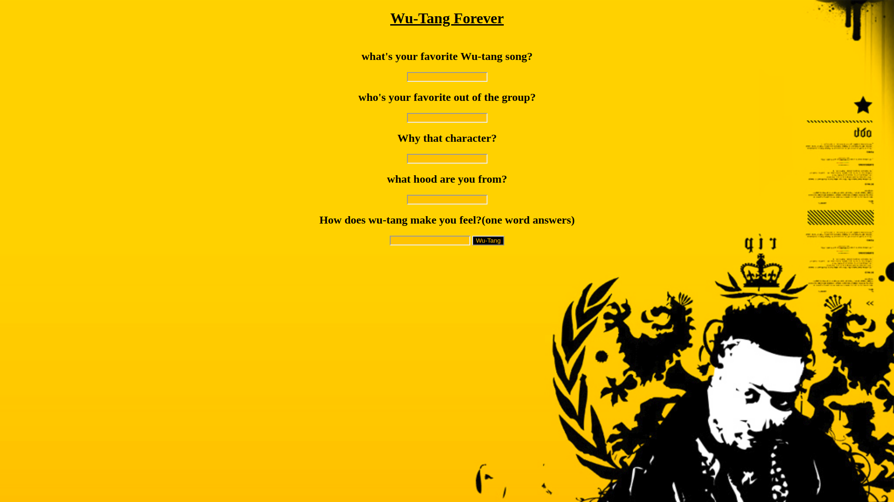

# My Awesome Project
This is an simple to-do list application that allows the user to be able to answer a survey question by populate the inputs and upon his/her answer they will receive the names of the Wu-Tang members.

## How It's Made:
HTML, CSS, JavaScript.

## Optimizations
I need to get the buttons to work and better style!

## Lessons Learned:
I learned how to use the ES6 code for JavaScript and made my writing my functions easier to write!

## portfolio:

**WEBSITE:** https:/johnfleurimond.com
